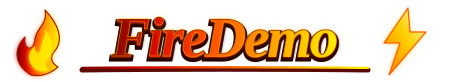
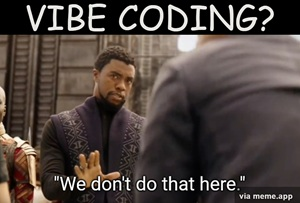

[-gray.svg?style=for-the-badge)](https://github.com/redgreenshift/Flames.st/blob/main/README.md)
[-gray.svg?style=for-the-badge)](https://github.com/redgreenshift/Greenshift/blob/main/README.md)
[-gray.svg?style=for-the-badge)](https://github.com/redgreenshift/friendly-neighborhood-status-indicator/blob/main/README.md)



[](https://www.raspberrypi.com/)
[](https://www.linux.org/)
[](https://www.microsoft.com/windows)
[](https://learn.microsoft.com/en-us/dotnet/csharp/)
[](https://dotnet.microsoft.com/platform/support/policy/dotnet-framework)
[](LICENSE)

`FireDemo` is a technical playground for exploring real-time lighting effects.


## Overview

Originally inspired by a Smalltalk experiment in 2000 to synthesize fire at runtime,
`FireDemo` has evolved into both a procedural lighting-effects playground
and a desktop status indicator, including use on Raspberry Pi systems.

## Effects

| Effect | Description |
|--------|-------------|
| **Realistic Flame** | Warm, natural-looking fire with multi-point color palettes and cooling maps |
| **Candle** | Small, gentle candle flame |
| **Bonfire** | Wide, energetic raging fire |
| **Dumpster Fire** | Playful combination of a static dumpster sprite and bonfire |
| **Batman Logo** | Bat-symbol outline rendered in fire, with options for single and multithreaded rendering |
| **Lightning** | Branching lightning bolts cascading down the flame grid |
| **Borg Plasma** | A Star Trek-inspired Borg Alcove regeneration plasma disc |
| **Sauron** | The Eye of Sauron, created by creatively layering other effects |
| **Status Text** | Availability screens such as `Available`, `Busy`, `Away`, `In a Meeting`, and `DND`, combining dynamic lighting, pixel art, and explanatory text |
| **RainBORG** | Demonstration of multiple plasma discs displayed simultaneously in different colors |
| **Rainbow Fire** | Demonstration of multiple independent flames using a gradient palette |


## Features

- Real-time fire, lightning, and plasma animation
- Configurable flame dimensions, magnification, interpolation, palettes, and cooling
- Multiple flame-seeding shapes, including candle, lightning, Batman logo,
  Borg plasma, and the Eye of Sauron
- Preset desktop availability-status screens
- Support for constant and spatially varying cooling strategies
- Experimental optimized and multithreaded rendering paths
- Windows execution through .NET Framework 4.8
- Linux and Raspberry Pi execution through Mono

## Requirements

### Windows

- Windows
- Visual Studio 2019 or later
- .NET Framework 4.8

### Linux and Raspberry Pi

The application is built as a Windows .NET Framework executable
but can also be run on Linux and Raspberry Pi systems using
[Mono](https://www.mono-project.com/).

The status-indicator layout is designed for a 1024×600 display, matching the
screen used by the Raspberry Pi device for which it was developed.

Linux rendering and performance may differ from Windows depending on the Mono
version, display configuration, and hardware.


## Quick Start

The project uses the standard `.csproj` format.

1. Clone the repository.
1. Open `FireDemo.sln` in Visual Studio.
1. Select the `FireDemo` project as the startup project.
1. Build the solution.
1. Run the project. Form2 starts by default.

The default startup view is **Form2**, the Friendly Neighborhood Status Indicator.

To explore the original parameter editor, select the "Original Experiment" button.

### Running on Linux

Build the application on Windows, copy the resulting Windows executable and
its required files to the Linux system, and run it with Mono:

```bash
mono FireDemo.exe
```

The exact executable name may vary depending on the project configuration.

The status-indicator form is designed for a 1024×600 display. On the Raspberry Pi,
the application window is sized to match that screen.

You may need to edit the dimensions if your device display differs.

Only tested on Raspian with Mono; your results may vary on other Linux flavors
depending on Mono version, display configuration, and hardware acceleration.

## Known Issues

- The project targets .NET Framework 4.8 rather than modern .NET.
- DPI scaling differs between Windows and Linux. A previous attempt to migrate to modern .NET introduced additional scaling issues and prevented Linux execution through Mono, so the project currently remains on .NET Framework 4.8.
- Form3 is experimental and may not improve performance on every system.
- Lightning becomes slow when rendering multiple high-resolution instances simultaneously. Future versions may explore alternative data structures that avoid processing large regions of mostly empty pixels.


## Application modes

### Form1 — Advanced FireDemo

Form1 is the _original_ parameter-exploration interface. It provides detailed
control over the lighting effects engine and is useful for fine-tuning values
that can later be used in presets.

It allows for deep adjustment of fire geometry, palettes, and cooling strategies.

Configurable parameters include:

- **Fire dimensions** — Width and height of the flame grid (affects performance and look)
- **Magnification** — How much the flame is scaled up on screen
- **Neighbor-selection** behavior - any pixels from 3x4 grid
- **Palette style** - flat, 4-point-linear, 7-point-hand-tuned
- **Cooling strategy** — Constant vs Map, with tuning for density, smoothing, shifting, and rotation
- **Seed shapes** (flame, bonfire, lightning, plasma) and heat intensity
- **Interpolation mode** — NearestNeighbor (pixelated), Bilinear (smooth), or Bicubic (extra smooth)

Available interpolation modes include:

- `NearestNeighbor` — pixelated rendering
- `Bilinear` — smoother rendering
- `Bicubic` — extra-smooth rendering

Form1 is primarily a development and experimentation tool rather than the
default user interface.

### Form2 — Availability Status Indicator

Form2 is the **default startup view**. It is designed as a desktop status indicator,
including use on a Raspberry Pi device.

A sequence of presets combine animated lighting effects with pixel art and text to make
the current availability status visible at a glance.

Select one of the preset statuses:

- Available
- Busy
- Away
- In a Meeting
- DND

Values explored in Form1 can be used to create or refine the presets used by
Form2.

This mode is intended for desktop use, including Raspberry Pi status-display projects.

### Form3 — Fast Render

Form3 is an experimental rendering path that bypasses `OnPaint` in an attempt
to achieve higher frame rates.

It did not work as well as expected and should be considered deprecated for now.


## How It Works

`FireDemo` renders animated lighting effects using a 2D grid of intensity values (0–255)
and pixel averaging. With different palettes, cooling strategies, and seed shapes, the
same core algorithm can produce realistic-looking fire, lightning, plasma, and other
effects.

The core algorithm is simple: each frame, the brightness of a pixel is calculated as
the average of neighboring pixels with some cooling applied. With well-tuned palettes
and cooling maps, that simple process produces surprisingly lifelike results.

1. **Averaging** — A cell's new intensity is calculated from a configurable subset of the surrounding 3×4 neighborhood.
1. **Cooling** — Each pixel loses some energy based on a cooling strategy (constant decay or a cooling map with density/smoothing/rotation)
1. **Seeding** — New heat is added along the bottom of the grid or inside a selected shape such as a candle, Batman logo, or lightning bolt.
1. **Color mapping** — Intensity values are converted into colors using an 8-bit indexed palette.
1. **Rendering** — The resulting frame is scaled and displayed using the selected interpolation mode.

The basic algorithm is simple, but the choice of palette, cooling map,
neighbor configuration, seed shape, and rendering scale produces a wide range
of visual effects resulting in realistic-looking fire, lightning, and plasma patterns.

### Palette styles

- **Flat** — Single-color palette where each intensity level scales RGB channels uniformly.
- **FourPointLinear** — Four-color gradient interpolated at 0%, 33%, 66%, and 100% intensity.
- **RealisticFlame** — Tuned seven-stop gradient ordered from hottest region outward: blue → white → yellow → orange → dark fringe. Suggests heat dissipating at flame edges for a natural-looking flame.
- **RealisticFlameColorized** — Corresponding gradient derived from user-specified base color, allowing flames rendered in arbitrary colors.
- **DarkFlame** — Exploration of what a “black” flame might look like, generalized to support any base color.
- **Lightning** — High-contrast palette optimized for realistic lightning-bolt effects. Derived from `RealisticFlame`, with default palette generated by mixing pinks and blues.
- **Plasma** — Optimized for plasma-disc-style effects, derived from `FourPointLinear`.

### Cooling strategies

- **Off** — No explicit decay. Intensity decreases only through integer truncation during averaging.
- **Constant** — Uniform decay rate across entire grid.
- **Map** — Spatially varying cooling with configurable density, min/max, smoothing, shifting, and rotation.

The map-based strategy produces more varied movement and helps create the
characteristic appearance of a flame.

## Architecture highlights

- **`ILightShape`** — Defines the flame-seeding patterns (candle, lightning, Batman logo, Borg ring, Sauron eye).
- **`ILightPen`** — Controls how new heat is seeded (fill density, intensity range, full vs binary range).
- **`ICoolingStrategy`** — Strategy pattern used to remove energy from flame grid.
- **`SimpleSprite`** / **`DynamicSprite`** / **`LayeredSprite`** — Rendering hierarchy for compositing multiple flame layers.
- **`RealtimeLightEffect`** — Implements core render loop with double-buffered flame computation.
- **`RealtimeFireBatLogoOptimizedMT_ThreadPool`** — Multithreaded rendering path.
- Supports both Windows and Linux (with DPI-aware scaling adjustments).

## Project History

The project dates back to February 2000, tracing its roots to [`Flames.st`](https://github.com/redgreenshift/Flames.st)
which was itself inspired by someone claiming Smalltalk was too slow for real-time fire generation.

I accepted the challenge and set out to prove that real-time procedurally generated fire was practical in Smalltalk.

Since the creation of `FireDemo` in 2015, it has served as a place to experiment with rendering
techniques, color palettes, cooling algorithms, procedural effects, and occasionally
whatever lighting-related idea seems interesting enough to investigate — adding
palettes, cooling maps, flame shapes, lightning, the Borg plasma disc,
the Eye of Sauron, static sprites and text, and even a lightweight presentation mechanism
for creating short animated presentations that demonstrate the evolution of various effects.

While the engine began as a tool for parameter exploration of dynamic lighting effects,
it was later redesigned as a standalone status indicator, used on desktop devices
like a Raspberry Pi to communicate my availability at a glance.

Although the project still carries the name "FireDemo", much of the code now serves
as a general-purpose lighting-effects framework capable of producing far more than fire.

### Design Philosophy

Most features were not planned from the beginning. They emerged gradually while
exploring previous ideas, improving existing effects, or adapting techniques
developed elsewhere in the project. In many cases, solving one problem unexpectedly
made a different idea possible.

The goal has never been to build a commercial graphics engine or a polished product.
The goal is to explore graphics techniques, learn from the results, and create something
visually interesting, occasionally sparking new ideas for the next round of experimentation.

Many of the project's more unusual features exist because I found myself asking questions such as:

- What would happen if I tried this?
- Could I actually make this idea work?

Sometimes the result was useful. Sometimes it was merely interesting. Sometimes it failed completely. Regardless of the outcome, I always _learned_ something along the way.

Some ideas eventually grow into separate projects. Occasionally those ideas find their way back into FireDemo in a new form.

### Related Projects

#### Predecessor Projects

`FireDemo` grew directly from [`Flames.st`](https://github.com/redgreenshift/Flames.st), a Smalltalk-80 project created to
demonstrate that real-time fire graphics were possible in the language. It
expanded that idea into a broader real-time lighting-effects playground
including fire, lightning, and plasma.

[`Greenshift`](https://github.com/redgreenshift/Greenshift) is a looser ancestor.
`FireDemo` carried forward ideas including `BitCanvas`, frame-to-frame decay values, and configurable color palettes,
while exploring a broader range of real-time lighting effects.

#### Successor Projects

The [`Friendly Neighborhood Status Indicator`](https://github.com/redgreenshift/friendly-neighborhood-status-indicator)
grew directly from `FireDemo Form1`, and then was later ported back to C# as `FireDemo Form2`, creating a cycle in the lineage tree.

### Funny Circular Lineage

The lineage makes more sense visually than verbally:

```text
Flames.st (Smalltalk) ───┐
                         ├──> FireDemo Form1 (C#)
Greenshift (C++) ────────┘          │
                                    v
                    Friendly Neighborhood Status Indicator (Smalltalk)
                                    │
                                    v
                FireDemo Form2 + Friendly Neighborhood Status Indicator (C#)
```

The lineage is more of a family cyclic graph than a strict tree:

- `Flames.st` is the original Smalltalk-80 fire experiment. It explored real-time fire generation and demonstrated that the technique was practical in Smalltalk.
- `Greenshift` introduced ideas such as BitCanvas, and tuned color palettes.
- `FireDemo Form1` brought ideas from both projects together in a C# parameter-exploration tool for more complex light-effects.
- The parameter exploration led to the `Neighborhood Desktop Availability Display Device (NDADD)`, a Raspberry Pi touchscreen device running a Smalltalk program to indicate my current availability status to coworkers using fun light-effects, later renamed to [`Friendly Neighborhood Status Indicator`](https://github.com/redgreenshift/friendly-neighborhood-status-indicator).
- The ability to run C# on Linux led to the availability-display concept being ported back into C# as `FireDemo Form2`, the **Friendly Neighborhood Status Indicator**.

Therefore, in a sense:
```text
FireDemo Form1
    ↓
  FNSI
    ↓
FireDemo Form2
```
[**FireDemo is its own grandparent!**](https://www.youtube.com/watch?v=rALCtcMoMh8)

## Contributing

`FireDemo` is primarily a personal playground that I share publicly.

Pull requests are welcome, but acceptance is not guaranteed. Proposed changes should align with the goals and direction of the project, which often prioritizes exploration, learning, and experimentation over feature completeness.

All code must be reviewed and fully understood by the project author before being merged. Contributions that add significant complexity without a corresponding educational, experimental, or practical benefit are unlikely to be accepted.

Bug reports, suggestions, performance investigations, and ideas for new lighting effects are always appreciated.

`FireDemo` is shared publicly because others may find the techniques interesting, useful, or entertaining, but its primary purpose remains the same as when it started in 2000:

> Try an idea and see what happens.

## AI Policy

<p align="center">
  <a href="https://en.wikipedia.org/wiki/Vibe_coding">
  
  </a>
</p>

Contributions from AI agents are welcome, provided they are reviewed by a
human before being committed. Every change MUST be approved by a real person;
approval by an automated process or another AI agent alone is insufficient.

AI tools may be used to suggest code ideas or help draft comments, but all
code is reviewed by the project author before committing. Code that the
author does not fully understand is not committed.

## License

FireDemo is free software; you can redistribute it and/or modify it under the terms of the GNU General Public License as published by the Free Software Foundation; version 2 only.

FireDemo is distributed in the hope that it will be useful, but WITHOUT ANY WARRANTY; without even the implied warranty of MERCHANTABILITY or FITNESS FOR A PARTICULAR PURPOSE.  See the GNU General Public License for more details.

You should have received a copy of the GNU General Public License along with this program; see [`LICENSE`](LICENSE).

---

## Contact & Links

* [GitHub Repository](https://github.com/redgreenshift/firedemo)
* [Website](http://greenshift.net)
* **Author:** [Jared Ivey](mailto:jared.ivey+greenshift@outlook.com)
